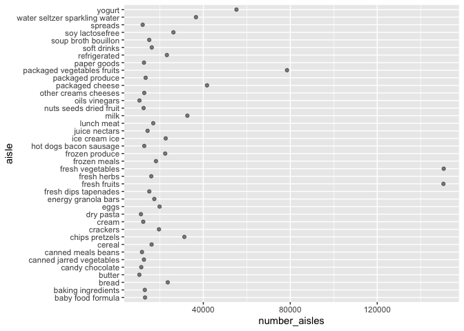
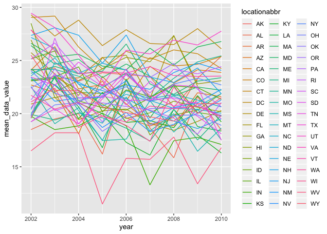
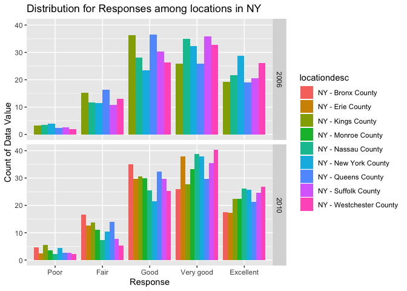
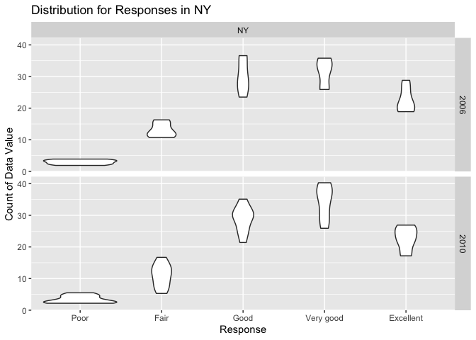
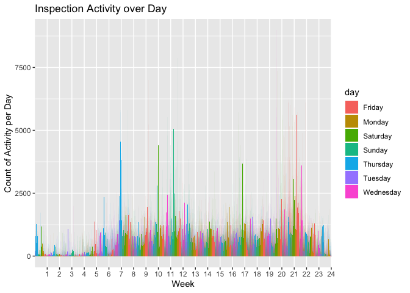

HW3
================
Tianhui He
2019/10/11

``` r
library(ggplot2)
library(ggridges)
```

    ## 
    ## Attaching package: 'ggridges'

    ## The following object is masked from 'package:ggplot2':
    ## 
    ##     scale_discrete_manual

``` r
library(tidyverse)
```

    ## ── Attaching packages ──────────────────────────────────────────────────────────────── tidyverse 1.2.1 ──

    ## ✔ tibble  2.1.3     ✔ purrr   0.3.2
    ## ✔ tidyr   1.0.0     ✔ dplyr   0.8.3
    ## ✔ readr   1.1.1     ✔ stringr 1.3.1
    ## ✔ tibble  2.1.3     ✔ forcats 0.4.0

    ## ── Conflicts ─────────────────────────────────────────────────────────────────── tidyverse_conflicts() ──
    ## ✖ dplyr::filter()                   masks stats::filter()
    ## ✖ dplyr::lag()                      masks stats::lag()
    ## ✖ ggridges::scale_discrete_manual() masks ggplot2::scale_discrete_manual()

### Problem 1

Basic setup:

``` r
library(p8105.datasets)
data("instacart")
```

The dataset instacart has dimention of 1384617 X 15. Variables include order\_id, product\_id, add\_to\_cart\_order, reordered, user\_id, eval\_set, order\_number, order\_dow, order\_hour\_of\_day, days\_since\_prior\_order, product\_name, aisle\_id, department\_id, aisle, department. Important characters include product\_name and aisle while some viatal numeric variables are product\_id and order\_hour\_of\_day. Important varibles used to solve this question include product\_name since this is a unique identifier of products, and manipulation involve products is based on this important variable.

``` r
ins_aisles = 
instacart %>%
  count(aisle, name ="number_aisles") %>%
  arrange(desc(number_aisles)) 
```

By using the count command, we can see that fresh vegetables is the most item ordered from. There are 134 aisles(also use length function to check) and the number of fresh vegetables is 150609.

Scatterplot:

``` r
ins_aisles%>%
  filter(number_aisles > 10000) %>%
  ggplot(aes(y = aisle, x = number_aisles)) + 
  geom_point(alpha = .5)
```

 Here, I use a scatterplot rather a histogram,because it shows a more clear graph of relative position among the count of each kind of aisle.

``` r
instacart_pop =
instacart %>%
  group_by(aisle) %>%
  count(product_name, name ="number_product_name") %>%
  filter(aisle %in% c("baking ingredients", "dog food care", "packaged vegetables fruits")) 
instacart_pop %>% 
  group_by(aisle) %>% 
  arrange(desc(number_product_name)) %>% 
  top_n(3) %>% 
  knitr :: kable()
```

    ## Selecting by number_product_name

| aisle                      | product\_name                                 |  number\_product\_name|
|:---------------------------|:----------------------------------------------|----------------------:|
| packaged vegetables fruits | Organic Baby Spinach                          |                   9784|
| packaged vegetables fruits | Organic Raspberries                           |                   5546|
| packaged vegetables fruits | Organic Blueberries                           |                   4966|
| baking ingredients         | Light Brown Sugar                             |                    499|
| baking ingredients         | Pure Baking Soda                              |                    387|
| baking ingredients         | Cane Sugar                                    |                    336|
| dog food care              | Snack Sticks Chicken & Rice Recipe Dog Treats |                     30|
| dog food care              | Organix Chicken & Brown Rice Recipe           |                     28|
| dog food care              | Small Dog Biscuits                            |                     26|

A table shows the mean of hour:

``` r
instacart_mean =
  instacart %>% 
  drop_na() %>% 
  distinct() %>% 
  select(product_name,order_dow,order_hour_of_day) %>% 
  filter(product_name %in% c("Pink Lady Apples","Coffee Ice Cream")) 
instacart_mean =
  instacart_mean %>% 
   mutate(
  order_dow = recode(order_dow, '0' = "Sunday",'1' = "Monday",'2' = "Tuesday",'3' = "Wednesday", '4' = "Thursday", '5' =    "Friday", '6' = "Saturday")
 ) %>% 
  group_by(order_dow, product_name) %>% 
  summarize(
    mean_order_hour_of_day = mean(order_hour_of_day)) %>%
  pivot_wider(names_from = order_dow,
              values_from = mean_order_hour_of_day) %>% 
  select(product_name, Sunday, Monday, Tuesday, Wednesday, Thursday, Friday, Saturday)
knitr :: kable(instacart_mean)
```

| product\_name    |    Sunday|    Monday|   Tuesday|  Wednesday|  Thursday|    Friday|  Saturday|
|:-----------------|---------:|---------:|---------:|----------:|---------:|---------:|---------:|
| Coffee Ice Cream |  13.77419|  14.31579|  15.38095|   15.31818|  15.21739|  12.26316|  13.83333|
| Pink Lady Apples |  13.44118|  11.36000|  11.70213|   14.25000|  11.55172|  12.78431|  11.93750|

### Problem 2

Basic data cleaning:

``` r
library(p8105.datasets)
data("brfss_smart2010") 
brfss = 
  brfss_smart2010 %>% 
  janitor::clean_names() %>%  #format the data use appropriate variable names
  filter(topic == "Overall Health") %>% #focus on topic
  filter(response %in% c("Excellent","Very good","Good","Fair","Poor")) %>%  # responses from "Excellent" to "Poor", used unique command to check what are categories in response
  mutate(
     response = as.factor(response),
     response = fct_relevel(response, c("Poor","Fair","Good","Very good","Excellent"))) %>%   
     arrange(response,desc(response))#responses as a factor taking levels orders
```

For 2002, there are six states were observed at 7 or more locations. They were CT, FL, MA, NC, NJ,and PA.

``` r
brfss_2002= 
  brfss %>%
  select(year,locationabbr,locationdesc) %>% 
  filter(year == "2002") %>% 
  group_by(locationabbr) %>% 
  count(locationabbr, name = "number_of_location") %>% 
  mutate(
    number_of_location = number_of_location/5
  ) %>% 
  filter(number_of_location > 6)
brfss_2002
```

    ## # A tibble: 6 x 2
    ## # Groups:   locationabbr [6]
    ##   locationabbr number_of_location
    ##   <chr>                     <dbl>
    ## 1 CT                            7
    ## 2 FL                            7
    ## 3 MA                            8
    ## 4 NC                            7
    ## 5 NJ                            8
    ## 6 PA                           10

For 2010, there is a significant increase in the number of locations that satisfy our requirements. Specifically, 14 states are obseved at 7 or more locations.

``` r
brfss_2010= 
  brfss %>%
  select(year,locationabbr,locationdesc) %>% 
  filter(year == "2010") %>% 
  group_by(locationabbr) %>% 
  count(locationabbr, name = "number_of_location") %>% 
  mutate(
    number_of_location = number_of_location/5
  ) %>% 
  filter(number_of_location > 6)
brfss_2010
```

    ## # A tibble: 14 x 2
    ## # Groups:   locationabbr [14]
    ##    locationabbr number_of_location
    ##    <chr>                     <dbl>
    ##  1 CA                           12
    ##  2 CO                            7
    ##  3 FL                           41
    ##  4 MA                            9
    ##  5 MD                           12
    ##  6 NC                           12
    ##  7 NE                           10
    ##  8 NJ                           19
    ##  9 NY                            9
    ## 10 OH                            8
    ## 11 PA                            7
    ## 12 SC                            7
    ## 13 TX                           16
    ## 14 WA                           10

``` r
brfss_datavalue = 
brfss %>% 
  filter(response == "Excellent") %>% 
  group_by(locationabbr, year) %>% 
  summarize(
    mean_data_value = mean(data_value),
    ) %>% 
  drop_na()
brfss_datavalue
```

    ## # A tibble: 439 x 3
    ## # Groups:   locationabbr [51]
    ##    locationabbr  year mean_data_value
    ##    <chr>        <int>           <dbl>
    ##  1 AK            2002            27.9
    ##  2 AK            2003            24.8
    ##  3 AK            2004            23.0
    ##  4 AK            2005            23.8
    ##  5 AK            2007            23.5
    ##  6 AK            2008            20.6
    ##  7 AK            2009            23.2
    ##  8 AL            2002            18.5
    ##  9 AL            2003            19.5
    ## 10 AL            2004            20  
    ## # … with 429 more rows

A "spaghetti" plot:

``` r
ggplot(brfss_datavalue, aes(x = year, y = mean_data_value, color = locationabbr)) + 
  geom_line()
```

 A two panel plot for 2006 and 2010:

``` r
library(patchwork)
Two = 
brfss %>% 
  filter(year %in%  c("2006","2010")) %>% 
  select(year,locationabbr,response, data_value,locationdesc) %>% 
  drop_na() %>% 
  filter(response %in% c("Excellent","Very good","Good","Fair","Poor")) %>% 
  filter(locationabbr == "NY")

Two %>% 
  group_by(year,locationdesc,locationabbr) %>% 
  ggplot(aes(x = response, y = data_value, fill = locationdesc)) + 
  geom_bar(stat = "identity", position = "dodge") +
  facet_grid(year ~ .) +
  labs(
    title = "Distribution for Responses among locations in NY",
    x = "Response",
    y = "Count of Data Value"
  )
```

 This graoh has an emphases on different locations among New York States. I did another graph only showing the distribution across New York City. This one utilizes a violin plot. I think here, geom\_violin gives a better idea of how distribution looks than boxplot does.

``` r
Two %>% 
  group_by(year,locationdesc,locationabbr) %>% 
  ggplot(aes(x = response, y = data_value)) + 
  geom_violin() +
  facet_grid(year ~ locationabbr) +
  labs(
    title = "Distribution for Responses in NY",
    x = "Response",
    y = "Count of Data Value"
  )
```

 \#\#\# Problem 3 Because the original data frame is not shown in a data frame that is easy to manipulate. So I use pivot longer to change the data format. Initually, it has 1443 columns and now I transpose variable activity numbers into observation numbers. The new table contains 6 variables and 50400 observations.The new variable "WeekDay" I creat is to point out whether that day is a weekday. Important vairables include week(int), day\_id(int), activity\_number(char), day(char) and activity\_counts(dbl) and WeekDay(char). Since the table is already tailored into a more concise one, I think each variable is as important as each other :)

``` r
accel= read_csv("accel_data.csv") %>% 
  janitor::clean_names() %>% 
  pivot_longer(
    activity_1:activity_1440,
    names_to = "activity_number",
    values_to = "activity_counts"
  ) %>% 
mutate(
  WeekDay = ifelse(day == "Saturday" | day == "Sunday", "weekend", "weekday")
) %>% #new variable indicate weekday or weekend day
  mutate(
  activity_number = factor(activity_number)) # change activity number as a factor
```

    ## Parsed with column specification:
    ## cols(
    ##   .default = col_double(),
    ##   week = col_integer(),
    ##   day_id = col_integer(),
    ##   day = col_character()
    ## )

    ## See spec(...) for full column specifications.

``` r
  knitr::kable(head(accel,30)) # this is such a long table, so showing just the first 30 rows
```

|  week|  day\_id| day    | activity\_number |  activity\_counts| WeekDay |
|-----:|--------:|:-------|:-----------------|-----------------:|:--------|
|     1|        1| Friday | activity\_1      |          88.37778| weekday |
|     1|        1| Friday | activity\_2      |          82.24444| weekday |
|     1|        1| Friday | activity\_3      |          64.44444| weekday |
|     1|        1| Friday | activity\_4      |          70.04444| weekday |
|     1|        1| Friday | activity\_5      |          75.04444| weekday |
|     1|        1| Friday | activity\_6      |          66.26667| weekday |
|     1|        1| Friday | activity\_7      |          53.75556| weekday |
|     1|        1| Friday | activity\_8      |          47.84444| weekday |
|     1|        1| Friday | activity\_9      |          55.46667| weekday |
|     1|        1| Friday | activity\_10     |          42.95556| weekday |
|     1|        1| Friday | activity\_11     |          46.75556| weekday |
|     1|        1| Friday | activity\_12     |          25.48889| weekday |
|     1|        1| Friday | activity\_13     |          18.97778| weekday |
|     1|        1| Friday | activity\_14     |          31.11111| weekday |
|     1|        1| Friday | activity\_15     |          22.86667| weekday |
|     1|        1| Friday | activity\_16     |          24.80000| weekday |
|     1|        1| Friday | activity\_17     |          51.02222| weekday |
|     1|        1| Friday | activity\_18     |          35.48889| weekday |
|     1|        1| Friday | activity\_19     |          40.97778| weekday |
|     1|        1| Friday | activity\_20     |          59.02222| weekday |
|     1|        1| Friday | activity\_21     |          25.17778| weekday |
|     1|        1| Friday | activity\_22     |          19.42222| weekday |
|     1|        1| Friday | activity\_23     |          44.71111| weekday |
|     1|        1| Friday | activity\_24     |          17.13333| weekday |
|     1|        1| Friday | activity\_25     |          43.88889| weekday |
|     1|        1| Friday | activity\_26     |          47.46667| weekday |
|     1|        1| Friday | activity\_27     |          46.11111| weekday |
|     1|        1| Friday | activity\_28     |          34.64444| weekday |
|     1|        1| Friday | activity\_29     |          40.28889| weekday |
|     1|        1| Friday | activity\_30     |          46.46667| weekday |

My table for this question has 35 observation, containning 7 observations for each day. There's an increasing trend in the number of activity from Monday to Friday, except for weeks 3 and 4. In general, sunday has a low number of activities compared across other weekdays within the same week.

``` r
accel_day = 
accel %>% 
  group_by(week,day) %>%
  mutate(
    sum_activity_day = sum(activity_counts)
    ) %>% 
  select(week, day_id, day, sum_activity_day) %>% 
  distinct()
  knitr::kable(accel_day)
```

|     week|  day\_id| day       |  sum\_activity\_day|
|--------:|--------:|:----------|-------------------:|
|        1|        1| Friday    |           480542.62|
|        1|        2| Monday    |            78828.07|
|        1|        3| Saturday  |           376254.00|
|        1|        4| Sunday    |           631105.00|
|        1|        5| Thursday  |           355923.64|
|        1|        6| Tuesday   |           307094.24|
|        1|        7| Wednesday |           340115.01|
|        2|        8| Friday    |           568839.00|
|        2|        9| Monday    |           295431.00|
|        2|       10| Saturday  |           607175.00|
|        2|       11| Sunday    |           422018.00|
|        2|       12| Thursday  |           474048.00|
|        2|       13| Tuesday   |           423245.00|
|        2|       14| Wednesday |           440962.00|
|        3|       15| Friday    |           467420.00|
|        3|       16| Monday    |           685910.00|
|        3|       17| Saturday  |           382928.00|
|        3|       18| Sunday    |           467052.00|
|        3|       19| Thursday  |           371230.00|
|        3|       20| Tuesday   |           381507.00|
|        3|       21| Wednesday |           468869.00|
|        4|       22| Friday    |           154049.00|
|        4|       23| Monday    |           409450.00|
|        4|       24| Saturday  |             1440.00|
|        4|       25| Sunday    |           260617.00|
|        4|       26| Thursday  |           340291.00|
|        4|       27| Tuesday   |           319568.00|
|        4|       28| Wednesday |           434460.00|
|        5|       29| Friday    |           620860.00|
|        5|       30| Monday    |           389080.00|
|        5|       31| Saturday  |             1440.00|
|        5|       32| Sunday    |           138421.00|
|        5|       33| Thursday  |           549658.00|
|        5|       34| Tuesday   |           367824.00|
|        5|       35| Wednesday |           445366.00|
|  A plot:|         |           |                    |

``` r
accel %>% mutate(
  activity_number = factor(substr(activity_number,10,13), ordered = TRUE, levels = c(1:1440))
  ) %>% 
  ggplot(aes(x = factor(activity_number), y = activity_counts, fill = day)) +
  scale_x_discrete(breaks = seq(60, 1440, by=60),labels = as.character(c(1:24))) +
  geom_bar(stat = "identity", position = "dodge") +
  labs(
    title = "Inspection Activity over Day",
    x = "Week",
    y = "Count of Activity per Day"
  )
```



In this plot, I use hour as the plotting unit. So we can see a activity distribution across hours in everyday. In general, we can see that the patient's activity peak is between 18:00 to 21:00, and there is one extremely high peak happened during this time period which is over 10,000. On the other hand, we can see that the patient has fewer activity during 0 to 5. By rationality, this indicates that this patient is sleeping and that's why he conducts much fewer activities.
